# Task-Mng (Task Manager Kanban Board)

## Description

Task-Mng is a basic Client-side JavaScript web API and online kanban board presentation system. It is developed mostly by combining `HTML` and `CSS` for rendering with support of `JavaScript` and `jQuery` functional capabilities.

## Usage

New repository created at GitHub account strahinjapopovic as task-mng.

[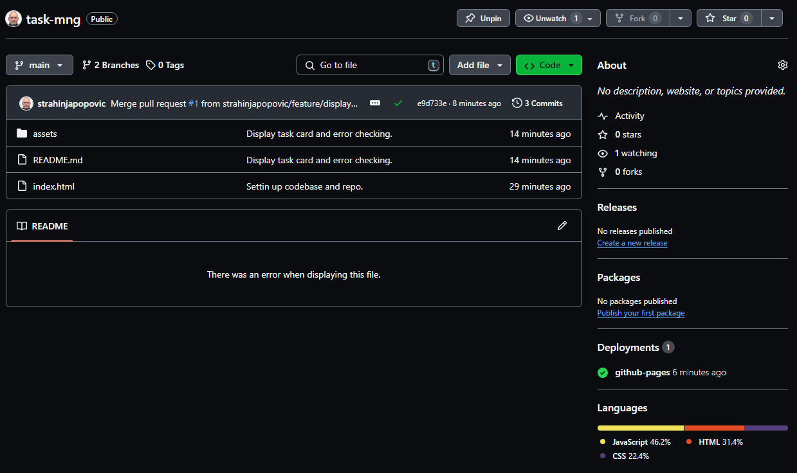](./assets/README-screenshots/github-task-mng-repo-created.PNG)

Project has been pushed from the local storage to GitHub repo as *(main)*.
*Continuing with Git Bash setting up codebase...*

[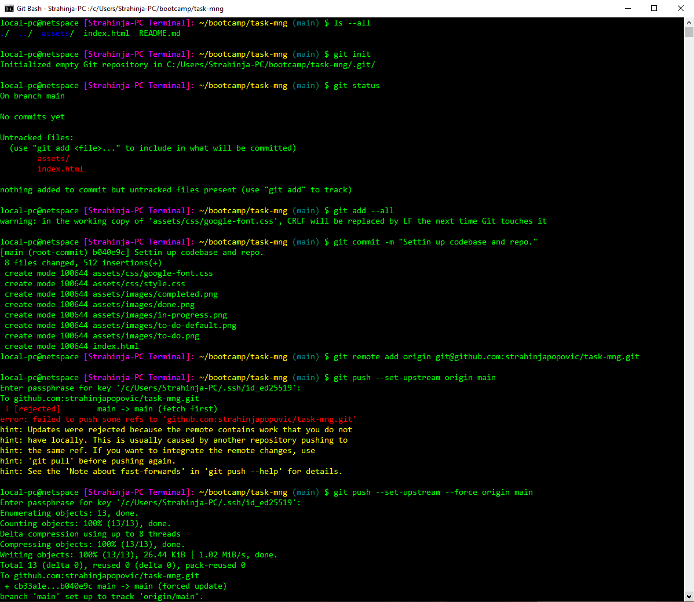](./assets/README-screenshots/git-bash-setting-up-codebase.PNG)

New **branch** was created as **(feature/display-card)** with Git Bash.

[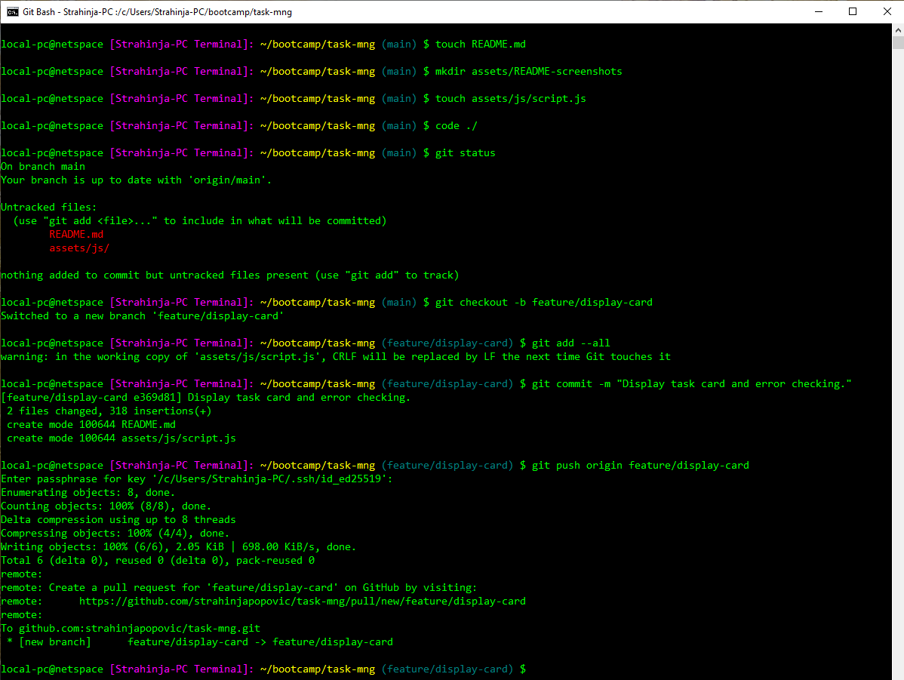](./assets/README-screenshots/git-bash-feature-branch-display-card.PNG)

*Continuing...*

[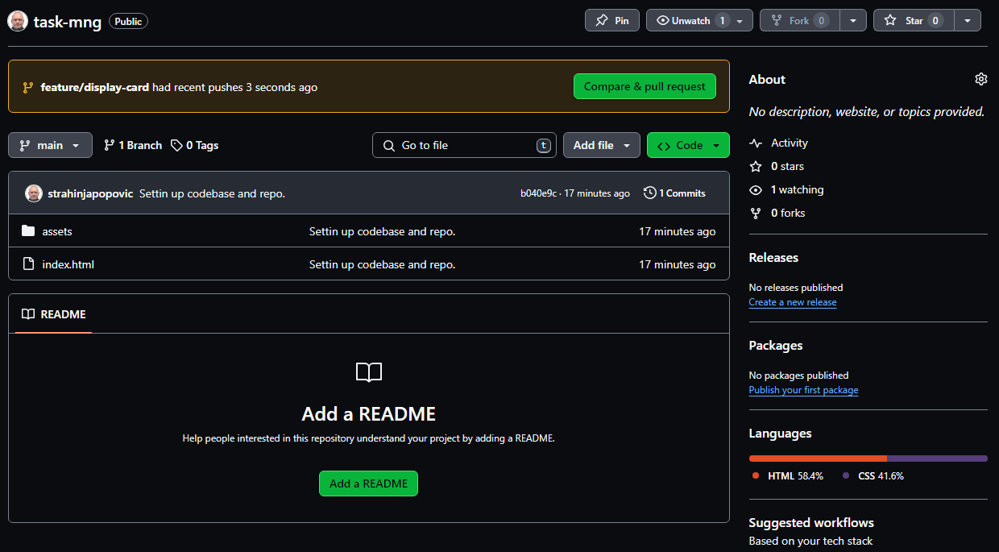](./assets/README-screenshots/github-feature-branch-page1.PNG)

Marge the ***(main)*** branch with ***(feature/display-card)*** feature branch as follows.

[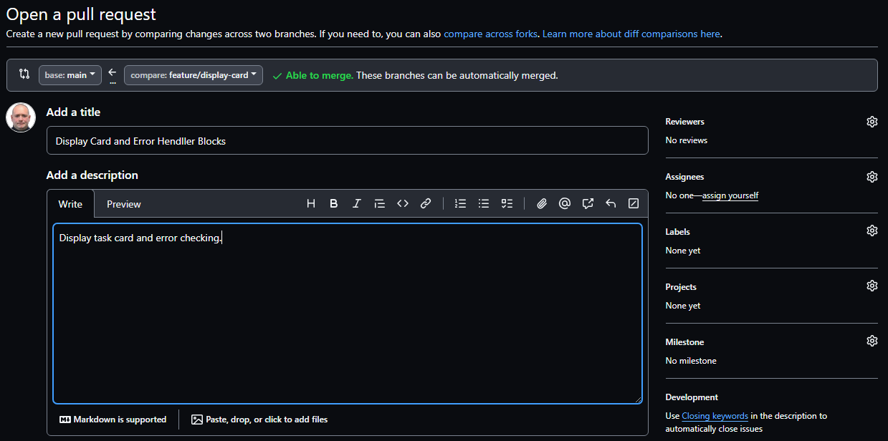](./assets/README-screenshots/github-feature-branch-marge-page2.PNG)

*Continuing...*

*Continuing(2)...*

[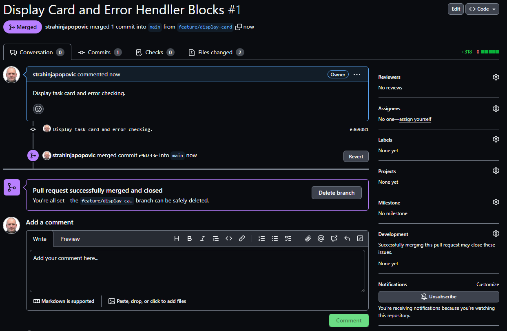](./assets/README-screenshots/github-feature-branch-marge-page4.PNG)

### *All Branches*

[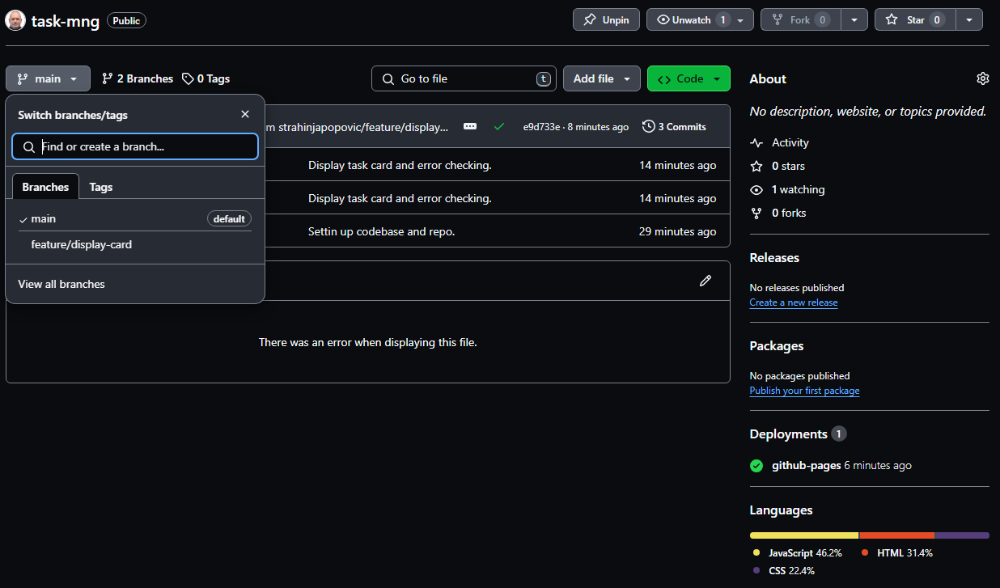](./assets/README-screenshots/github-all-branches.PNG)

### *Application has been deployed on a live server with a following results:*

*Card number 1 with input fields...*

[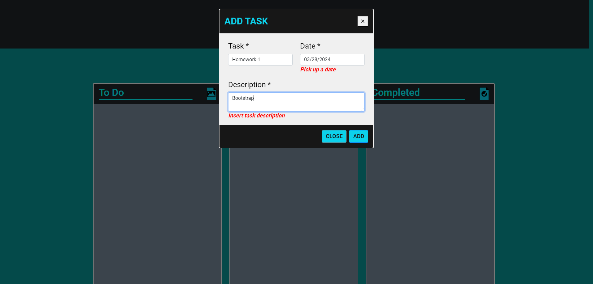](./assets/README-screenshots/testing-inputs-card1.PNG)

*Card number 1 display...*

[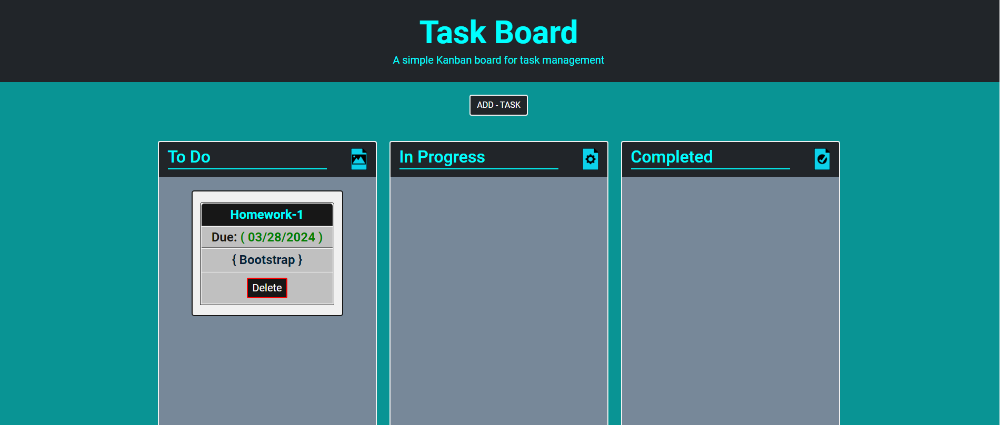](./assets/README-screenshots/testing-card1.PNG)

*Display 2 cards...*

[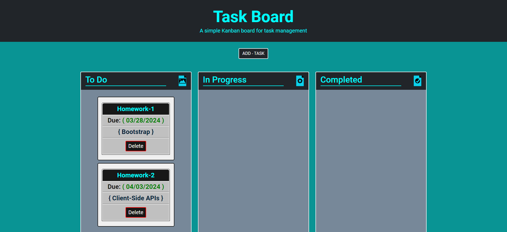](./assets/README-screenshots/testing-kanban-page1.PNG)

*Display up to 6 cards at once...*

[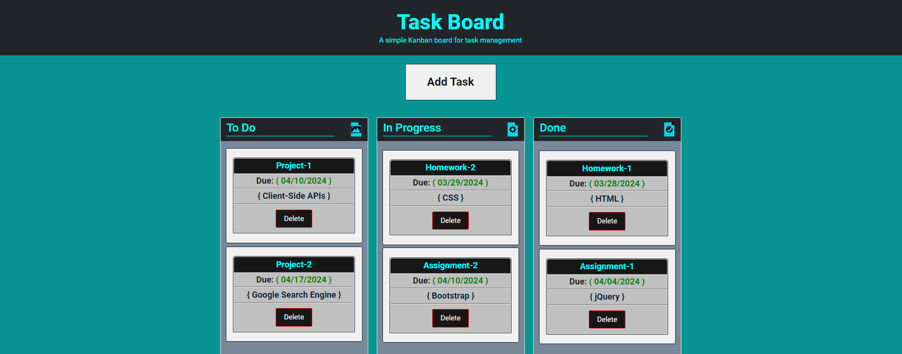](./assets/README-screenshots/testing-kanban-page-6cards.PNG)

*If inserting more then 6 cards at once error message appears as follows...*

[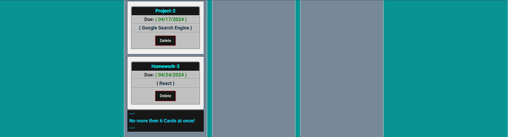](./assets/README-screenshots/testing-kanban-page-more-then-6cards-error.PNG)

Repository over GitHub account you can find [GitHub Repos][1] and application deployment at [GitHub Pages][2].

[1]: https://strahinjapopovic.github.io/task-mng/           "GitHub Repos"
[2]: https://strahinjapopovic.github.io/task-mng/           "GitHub Pages"

## License

Please refer to the MIT LICENSE in the repo.
